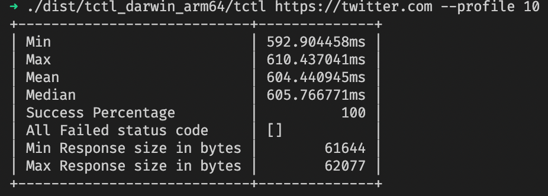

# TableCheck Take Home Assignment
> My submission for [TableCheck 2020 system engineering assignment](https://github.com/tablecheck/tablecheck-2020-systems-engineering-assignment)

`tctl` is a CLI application that access an URL and print the respond. It also has `--profile [number of request]` for profiling an URL by accessing it several times, and output the statistic like mean, median, and so on.

This docs is based on [this awesome template](https://raw.githubusercontent.com/jehna/readme-best-practices/master/README-default.md)

## Getting started

This project uses Go Modules on go version 1.16, and uses [goreleaser](https://goreleaser.com/) for build.

```shell
➜ goreleaser --snapshot --skip-publish --rm-dist
# Accees your binary on ./dist/tctl_<your-os>_<your-arch>/tctl
➜ ./dist/tctl_darwin_arm64/tctl https://tablecheck.dirathea.workers.dev/                                 
<!DOCTYPE html>
<html lang="en">
  <head>
    <meta charset="UTF-8" />
    <meta name="viewport" content="width=device-width, initial-scale=1.0" />
    <title>dirathea - tablecheck assignment</title>
    <link
      href="https://unpkg.com/tailwindcss@^1.0/dist/tailwind.min.css"
      rel="stylesheet"
    />
    <style>
      #links a {
        background: white;
        border: 1px solid white;
        width: 100%;
        padding: 1rem 2rem;
        margin-bottom: 1rem;
        font-weight: 600;
        border-radius: 6px;
        transition: ease-in-out 0.2s;
      }

      #links a:hover {
        background: none;
        color: white;
      }

      #social a {
        height: 32px;
        width: 32px;
        margin: 0 1rem;
      }

      #social a:hover {
        height: 36px;
        width: 36px;
        transition: ease-in-out 0.2s;
      }
    </style>
  </head>
  <body class="bg-indigo-900">
    <div class="mx-auto max-w-2xl min-h-screen flex flex-col items-center py-8">
      <div class="flex flex-col items-center" id="profile">
        
        <h1 class="text-md text-white mt-2 font-semibold" id="name">dirathea</h1>
      </div>

      <div
        class="flex flex-col space-between w-full px-8 text-center my-8"
        id="links"
      ><a href="https://www.tablecheck.com/">tablecheck</a>
<a href="https://www.linkedin.com/in/aldiraputra/">aldira</a>
<a href="https://www.tokyodev.com/companies/tablecheck/jobs/it-infrastructure-engineer/">tokyodev</a></div>

      <div id="social" class="flex w-1/2 justify-evenly"><a href="https://github.com/dirathea"><svg role="img" viewBox="0 0 24 24" xmlns="http://www.w3.org/2000/svg"><title>GitHub icon</title><path d="M12 .297c-6.63 0-12 5.373-12 12 0 5.303 3.438 9.8 8.205 11.385.6.113.82-.258.82-.577 0-.285-.01-1.04-.015-2.04-3.338.724-4.042-1.61-4.042-1.61C4.422 18.07 3.633 17.7 3.633 17.7c-1.087-.744.084-.729.084-.729 1.205.084 1.838 1.236 1.838 1.236 1.07 1.835 2.809 1.305 3.495.998.108-.776.417-1.305.76-1.605-2.665-.3-5.466-1.332-5.466-5.93 0-1.31.465-2.38 1.235-3.22-.135-.303-.54-1.523.105-3.176 0 0 1.005-.322 3.3 1.23.96-.267 1.98-.399 3-.405 1.02.006 2.04.138 3 .405 2.28-1.552 3.285-1.23 3.285-1.23.645 1.653.24 2.873.12 3.176.765.84 1.23 1.91 1.23 3.22 0 4.61-2.805 5.625-5.475 5.92.42.36.81 1.096.81 2.22 0 1.606-.015 2.896-.015 3.286 0 .315.21.69.825.57C20.565 22.092 24 17.592 24 12.297c0-6.627-5.373-12-12-12"/></svg></a>
<a href="https://twitter.com/diraldira"><svg role="img" xmlns="http://www.w3.org/2000/svg" viewBox="0 0 24 24"><title>Twitter icon</title><path d="M23.953 4.57a10 10 0 01-2.825.775 4.958 4.958 0 002.163-2.723c-.951.555-2.005.959-3.127 1.184a4.92 4.92 0 00-8.384 4.482C7.69 8.095 4.067 6.13 1.64 3.162a4.822 4.822 0 00-.666 2.475c0 1.71.87 3.213 2.188 4.096a4.904 4.904 0 01-2.228-.616v.06a4.923 4.923 0 003.946 4.827 4.996 4.996 0 01-2.212.085 4.936 4.936 0 004.604 3.417 9.867 9.867 0 01-6.102 2.105c-.39 0-.779-.023-1.17-.067a13.995 13.995 0 007.557 2.209c9.053 0 13.998-7.496 13.998-13.985 0-.21 0-.42-.015-.63A9.935 9.935 0 0024 4.59z"/></svg></a></div>
    </div>
  </body>
</html>
```

The command above will build the binary and execute the main command with https://tablecheck.dirathea.workers.dev/ as the target URL

### Initial Configuration

To prepare the project, run `go mod tidy`, and you good to go

## Developing

Simply clone the repository to your local, setup the project with `go mod tidy`, and open with your favourite IDE.

```shell
git clone git@github.com:dirathea/tctl.git
cd tctl/
go mod tidy
```

It will download all the dependency for developing the command line.

Basically we could do `go run main.go` to start the app imidiately. For example, to test your changes, do `go run main.go some-url-here`. It should be OK to use another tools like [cosmtrek/air](https://github.com/cosmtrek/air) to add hot reload whever you edit some code.

### Building

For convenience and unify the build process on local and CI process, install [goreleaser](https://goreleaser.com/install/) on your machine, and execute

```shell
goreleaser --snapshot --skip-publish --rm-dist
```

it will automatically delete your `dist` directory, build the `tctl`, and not publishing it to the repository.

## Features

### Profile
The `--profile` takes an integer argument as the number of request should be done by the apps. Then it will be print all the statistics to profile the URL.

```shell
➜ ./tctl https://tablecheck.dirathea.workers.dev/ --profile 10
Min 926.345292ms
Max 1.093930542s
Mean 1.027808608s
Median 1.041777208s
Total Success 100 %
All Failed status code []
Min size 3237
Max size 3237
```

Here's some comparison between several popular URL with parameters 10

| URL | Result |
| --- | ------ |
| https://tablecheck.dirathea.workers.dev/ |  |
| https://google.com/ |  |
| https://twitter.com/ |  |

## Links

- Assignment Page: https://github.com/tablecheck/tablecheck-2020-systems-engineering-assignment
- Related projects:
  - Assignment Prerequisite: https://github.com/tablecheck/cloudflare-2020-general-engineering-assignment/


<!-- ## Licensing

One really important part: Give your project a proper license. Here you should
state what the license is and how to find the text version of the license.
Something like:

"The code in this project is licensed under MIT license." -->
